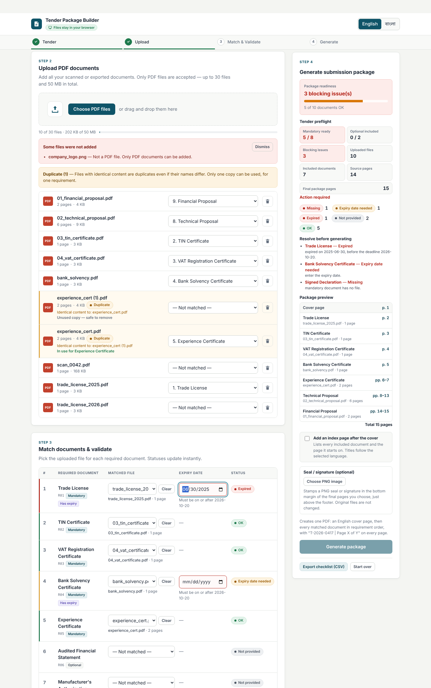

# Tender Document Package Builder

A frontend-only web app for office staff. Load a tender's `requirements.json`, upload PDF documents, match each one to a requirement, and validate the set. The app then produces one correctly ordered, submission-ready PDF with a cover page and `<tender_id> | Page X of Y` on every page.

All processing happens in the browser. There is no backend, no database, and no uploads to any server.

| | |
|---|---|
| **Participant** | Md. Ariful Islam |
| **Registration number** | 232-15-580 |
| **Live URL** | https://tender-package-builder.vercel.app |
| **Repository** | https://github.com/ariful-arif-232/devfest--232-15-580- |



## Run locally

Requires Node.js 20+.

```bash
npm install
npm run dev        # http://localhost:5173
npm run build      # production build in dist/
npm test           # logic + PDF unit tests on generated test fixtures, writing only to the OS temp dir (needs poppler-utils)
```

Optional browser test: run `npm run dev`, then `node tests/e2e.cjs` (requires Playwright).

## Workflow

1. **Tender:** open `requirements.json`. The app shows the tender details and the requirements, sorted numerically by `order`.
2. **Upload:** drag and drop or choose multiple PDFs. Each file shows its name, page count, size, duplicate state, its current match and a remove button.
3. **Match & Validate:** pick a file for each requirement, and enter expiry dates where needed. Statuses update instantly.
4. **Generate:** the button stays disabled until no blocking status remains. Then you can download `<tender_id>_Package.pdf`.

## Completed main features

- **`requirements.json` loading and validation.** Malformed input gives a clear error instead of a crash: invalid JSON, a missing `tender` section, a missing `tender_id`, an invalid deadline date, an empty requirement list, or a requirement with a missing or invalid `id`, `order`, `title_en` or `mandatory`, or a duplicate id. Requirements are sorted numerically by `order`, and no ids are hard-coded.
- **Multi-PDF upload, up to 30 files and 50 MB in total.** Non-PDF files are rejected with a message in the current language. A file is checked by its extension or MIME type, then by its `%PDF-` header.
- **Page count for each PDF,** read with pdf-lib.
- **One-to-one matching.** Each requirement row has a dropdown, and each file row has its own dropdown. Both stay in sync. A match can be changed, moved to another requirement (with a notice), or cleared. Removing a file clears its match immediately.
- **Duplicate detection by content.** The app computes a SHA-256 hash of each file's bytes with the Web Crypto API. All copies are marked and the duplication is explained. A copy cannot be matched to a different requirement while another copy is in use (that option is disabled and the reason is shown). Duplicates are recalculated when files are removed.
- **Expiry dates.** An expiry input appears when `has_expiry` is true and a file is matched. It is compared to the deadline as a `YYYY-MM-DD` string: an expiry before the deadline is Expired, and an expiry on or after the deadline is OK.
- **Status engine (`src/lib/status.js`).** Every requirement gets exactly one of: Missing, Expiry date needed, Expired, Not provided, or OK. The readiness summary, blocking-reason list, progress bar and Generate button all read from this single engine.
- **Generated PDF.** Page 1 is an English cover with the tender ID, title, procuring entity, bidder, deadline, generation date, and the list of included documents in final order with their page ranges. Long lists shrink to fit; if they still don't fit, the file-name lines are dropped so every included document stays listed (tested with 30 documents). Matched documents follow in requirement order. All original pages are kept in their original order, and unmatched optional requirements are skipped.
- **Footer.** Every page, including the cover, carries `<tender_id> | Page X of Y`. Y is the final total, computed before numbering. The footer is small, centred at the bottom on a light backing, and placed correctly on rotated pages.
- **Download** as `<tender_id>_Package.pdf`. Characters that are illegal in filenames are replaced.
- **Full English | বাংলা switch.** It covers the header, steps, buttons, labels, help text, statuses, errors, blocking reasons and generate/download actions, and uses Bangla numerals. Document names use `title_en` or `title_bn` depending on the language.
- **Responsive layout** from 320 px up to desktop width, with no horizontal scrolling. The app has keyboard-accessible controls, labelled inputs, live regions for status changes, a skip link, and support for reduced motion.

## Completed bonus features

- **Auto-match suggestions.** File names are normalised: case, spaces, underscores, hyphens, punctuation, `.pdf`, pure numbers and common noise words like "copy" or "scan" are ignored. They are then compared with each requirement's `title_en` and `title_bn`. A requirement only gets a suggestion when one file is the clear best match above a threshold; if files with different content tie, nothing is suggested. Suggestions show as "Suggested: …" with an Accept button and an "Accept all" option, and are never applied automatically.
- **Bad PDF handling.** Damaged, unreadable and password-protected PDFs are rejected with a message in English or Bangla. A file is only added after it has been parsed and its pages test-copied, so a failed file never partly enters the app, already-uploaded files are unaffected, and generation never uses an unreadable file.
- **CSV checklist export.** It exports the current state with the columns `document, file name, pages, expiry date, status`, as UTF-8 with a BOM so Excel shows Bangla correctly.
- **Index page (optional).** A toggle adds an index page after the cover, listing every included document with the page it starts on. Start pages come from each document's real page count, and adding the index shifts every later page by one. The cover, the index and every document page all carry `<tender_id> | Page X of Y`. For the official sample with the index on, the package is 17 pages: 1 cover, 1 index and 15 source pages.
- **Bangla text in the PDF.** When the UI is in বাংলা, the index page shows the heading, column labels and every document title in Bangla (`title_bn`). The app bundles Noto Sans Bengali (SIL OFL, see `src/assets/fonts/OFL.txt`) and loads it from the app itself, never from an external server. pdf-lib's own text engine shapes some Bengali conjuncts incorrectly (for example প্র and ট্রে), so the browser shapes the Bangla text with this font and the result is embedded as a high-resolution image. That makes the Bangla display correctly, but it can't be selected or searched as text. The cover stays in English with the required fields.
- **Save and reopen.** "Save work" stores the requirements, the uploaded PDF bytes, matches, expiry dates, language and the index setting in the browser's IndexedDB, on this device only. "Reopen saved work" restores it and re-checks every stored file's SHA-256, so duplicate detection stays valid. A file that is missing or changed is reported and its match is cleared. "Clear saved work" deletes everything stored.
- **Seal / signature (optional).** No seal is loaded by default, and an empty seal section never blocks generation. Validation starts only once you upload a PNG; any other file type is rejected with a message in English or Bangla. After upload, you must enter valid final page numbers (for example `1, 16` or `3-5`). Zero, negative, non-numeric, reversed and out-of-range values are rejected, and the pages that will get the seal are listed before you generate. The seal goes in the bottom-right or bottom-left corner of the bottom margin, between the footer and the page content. It keeps its aspect ratio, fits within 72 pt, stays inside the page and follows page rotation. It never changes page order, page count, index numbering, footers or source content. Removing the seal returns the app to normal generation straight away. On the official sample, the seal covers no text or graphics on any of the 16 pages in any corner or size. The cover's document list also stops above this margin area, so a seal never covers it.
- **Tender preflight and package preview.** These read the same status engine. The preflight shows mandatory documents ready, optional documents included, blocking issues, uploaded files, included documents, source pages and the predicted final page count, plus "Ready to generate" or "Action required". Each blocking issue is listed as "Document — Status"; clicking it scrolls to and focuses that requirement. The package preview lists the cover, the index (if on) and each document in final order with its file name, page count and page range.
- **Package ready summary.** It shows the file name, the number of included documents, the total pages and the validation result, with Download and "Preview PDF" buttons. Preview opens the PDF from a local blob URL in a new tab.
- **Trust indicator.** A "Files stay in your browser" / "ফাইল আপনার ব্রাউজারেই থাকে" badge in the header. This is accurate because there is no backend and nothing is uploaded.
- Not implemented: AI Help.

## Output

- [`output/T-2026-0417_Package.pdf`](output/T-2026-0417_Package.pdf) was generated from the official contest sample pack (`sample-pack/requirements.json` and `sample-pack/documents/`). It was produced through the deployed app's normal upload, match and generate workflow. The sample was resolved as follows:

  | # | Requirement | File | Expiry | Status |
  |---|---|---|---|---|
  | 1 | Trade License | `trade_license_2026.pdf` | 2027-06-30 | OK |
  | 2 | TIN Certificate | `03_tin_certificate.pdf` | — | OK |
  | 3 | VAT Registration Certificate | `04_vat_certificate.pdf` | — | OK |
  | 4 | Bank Solvency Certificate | `bank_solvency.pdf` | 2026-12-31 | OK |
  | 5 | Experience Certificate | `experience_cert.pdf` (one of the two identical copies) | — | OK |
  | 6 | Audited Financial Statement | — | — | Not provided (optional) |
  | 7 | Manufacturer's Authorization | — | — | Not provided (optional) |
  | 8 | Technical Proposal | `02_technical_proposal.pdf` | — | OK |
  | 9 | Financial Proposal | `01_financial_proposal.pdf` | — | OK |
  | 10 | Signed Declaration | `scan_0042.pdf` | — | OK |

  In the same run, `company_logo.png` was rejected as a non-PDF file. `experience_cert.pdf` and `experience_cert (1).pdf` were flagged as exact-content duplicates. `trade_license_2025.pdf` (expiry 2025-06-30) showed as Expired before it was replaced.

  The package has 16 pages: 1 cover page and 15 source pages. Every page carries `T-2026-0417 | Page X of 16`. Every source page was checked against the original file by rendering and comparing pixels. All pages are present, in the order above, unchanged above the footer strip. The footer sits in the blank bottom margin; on the scanned declaration, only the paper background is behind it.
- The committed package is the standard mode, with the index off and no seal, which is why it has 16 pages.
- `screenshots/` holds screenshots of the official sample pack: statuses with blocking issues (`statuses-blocking.png`), the resolved ready state (`statuses-en.png`), Bangla (`statuses-bn.png`), mobile (`mobile.png`), after generation (`generated-en.png`), a Bangla run with the index on (`generated-index-bn.png`), and a seal applied to pages 1 and 16 (`seal.png`).

## Known issues

- PDFs encrypted with only an owner password are treated as password-protected and rejected, because pdf-lib cannot decrypt them.
- The cover uses the standard Helvetica font, which only covers Latin characters. Any other characters in English tender fields are replaced with `?` on the cover; the web UI shows them correctly.
- The date picker's display format follows the browser's locale. Values are always stored and compared as `YYYY-MM-DD`.
- Bangla text on the index page is embedded as an image (see above), so it can't be selected or searched as text.
- Saved work lives in this browser's IndexedDB only. Clearing site data removes it, and it doesn't sync between devices.

## AI tools used

- Claude Code: scaffolding, implementation, tests and UI polish, all reviewed and verified by me through automated logic, PDF and browser tests.

## Most useful prompt

> Build a polished, frontend-only Tender Document Package Builder (Vite + React, pdf-lib, Web Crypto SHA-256) that loads requirements.json, uploads PDFs, matches them one-to-one to requirements, detects duplicate content, validates expiry dates against the submission deadline with an exact five-status engine (Missing / Expiry date needed / Expired / Not provided / OK), and generates `<tender_id>_Package.pdf` with an English cover and `<tender_id> | Page X of Y` on every page — fully bilingual (English | বাংলা) and with no sample data hard-coded.

## Tech

React 19, Vite, pdf-lib. No backend services.

## License

[MIT](LICENSE)
